**完整代码 + QQ: 316595344 或 微信: lz316595344 咨询**

**接毕业设计和论文**

**博客地址：https://blog.csdn.net/qq_56450993/article/details/136282620**

**视频演示：**

**毕业设计所有选题地址：**

- [github]👉https://github.com/XinChennn/allProjects

- [忻辰的个人博客]👉https://www.ixinjiu.cn/articles/156

# 基于Spring Boot + Thymeleaf 实现的任务发布网站（源码+数据库）
# 一、系统介绍
- 雇主：登录、注册、发布任务、选择中标雇员、评价雇员
- 雇员：登录、注册、查看任务列表、投标任务、收藏任务、完成任务
- 管理员、登录、任务管理、雇主管理、雇员管理
# 二、所用技术
后端技术栈：
- springboot
- mybatis
- mysql

前端技术栈：
- Thymeleaf
# 三、环境介绍
基础环境 :IDEA/eclipse, JDK 1.8, Mysql5.7及以上,Node.js,Maven

所有项目以及源代码本人均调试运行无问题 可支持远程调试运行
# 四、项目截图

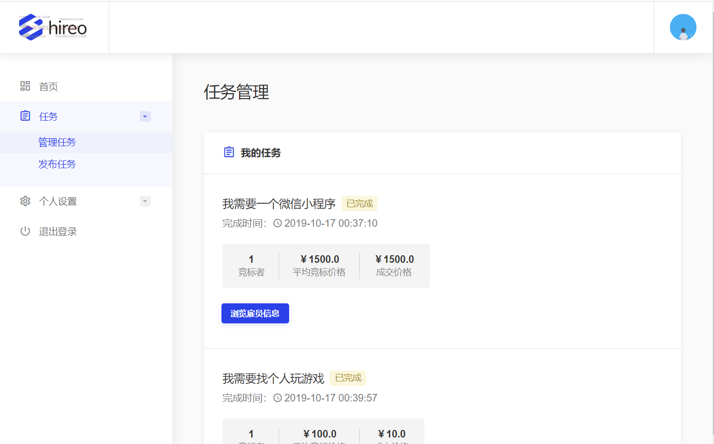

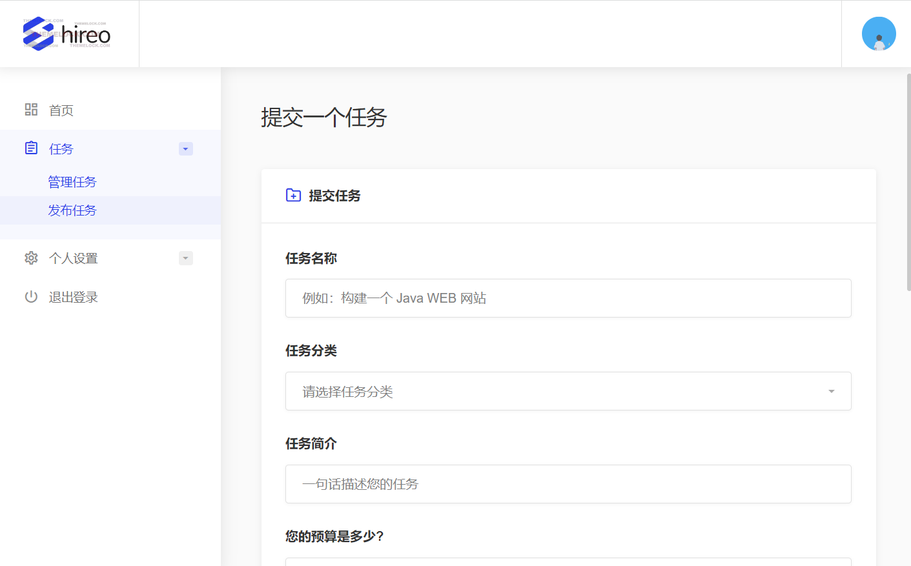

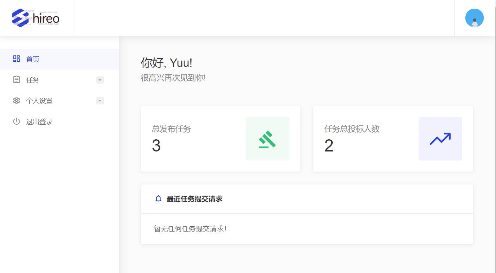

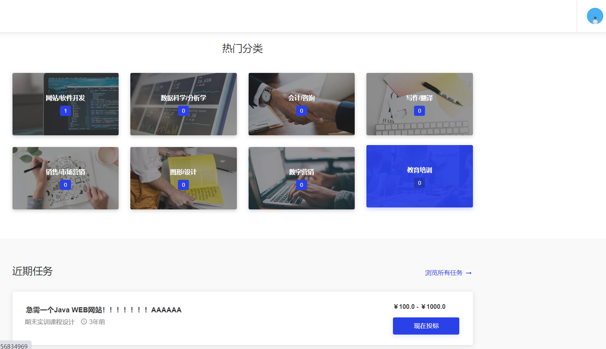

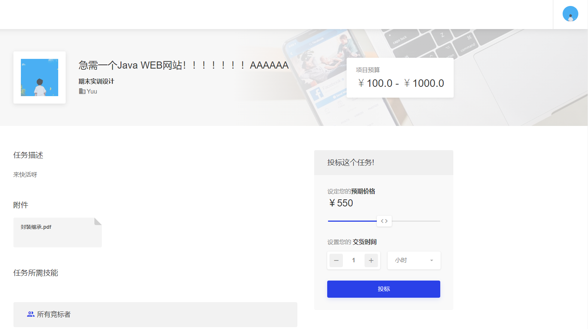

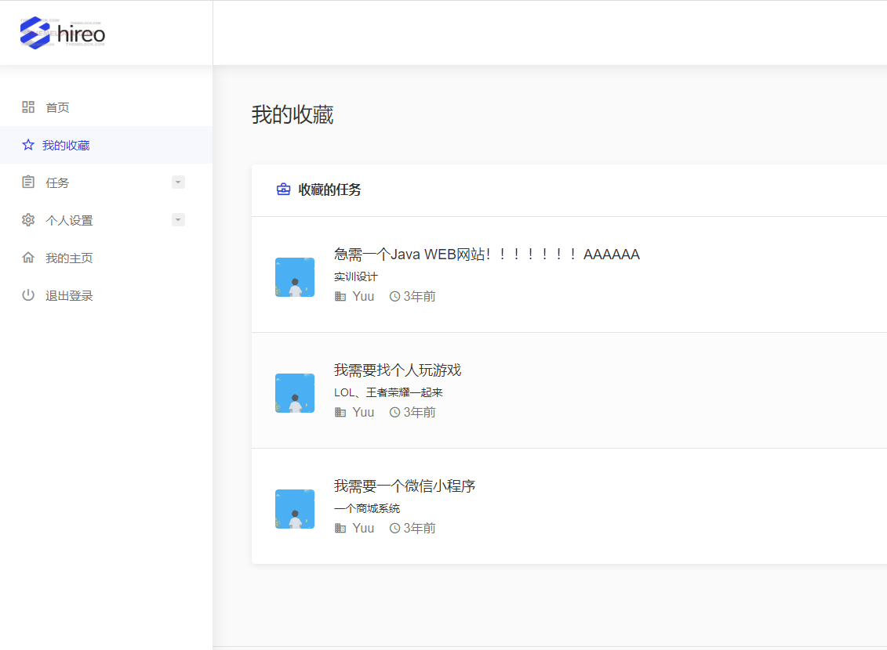

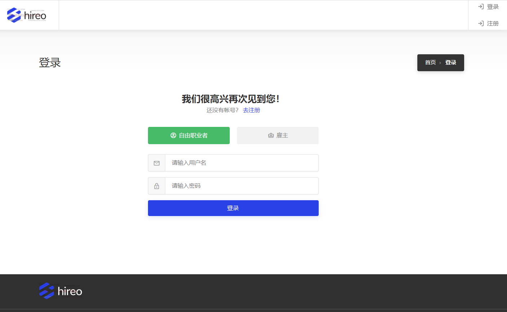

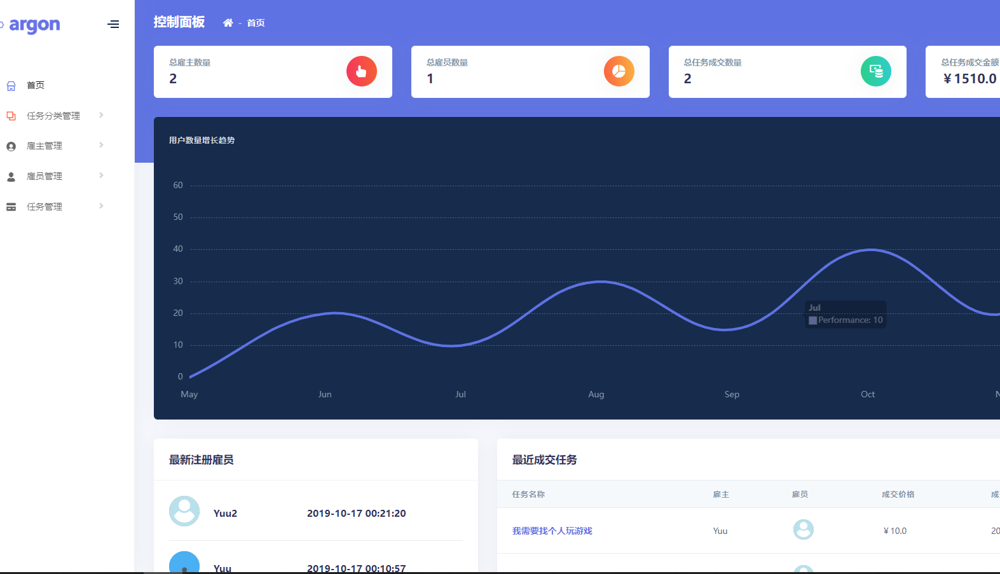

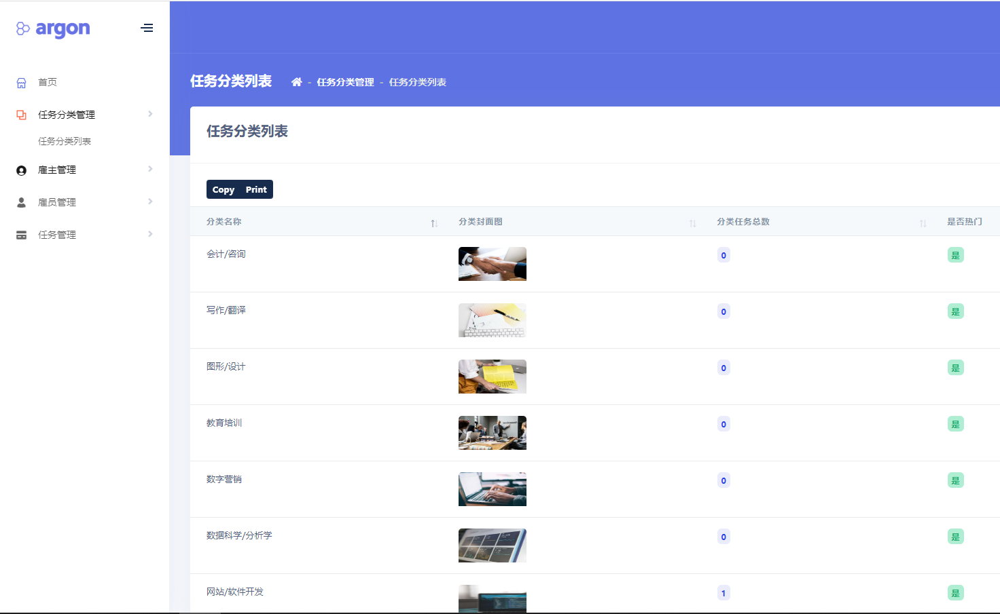

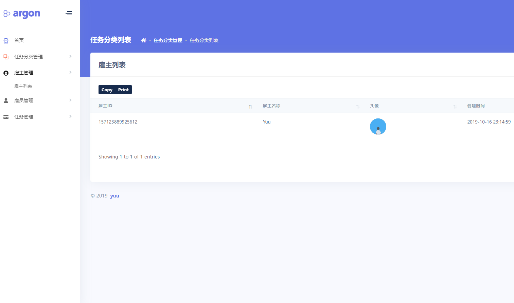

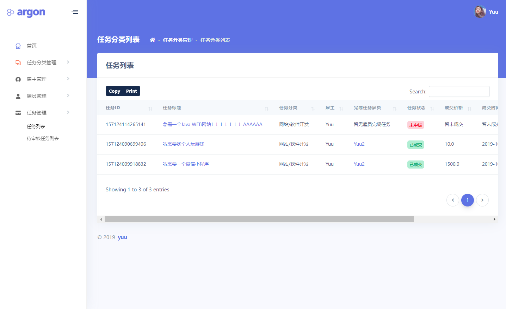

# 五、浏览地址
- 管理员 用户名： Yuu 密码：123456 登录地址：http://localhost:8080/admin/login
- 雇主 用户名： Yuu 密码：123456 登录地址：http://localhost:8080/index
- 雇员 用户名： Yuu 密码：123 登录地址：http://localhost:8080/index
# 六、安装教程（购买项目附赠免费部署）
1. 使用Navicat或者其它工具，在mysql中创建对应名称的数据库，执行数据库脚本 db/recruit.sql
2. 使用IDEA/Eclipse导入项目，若为maven项目请选择maven;导入成功后请执行maven clean;maven install命令，然后运行；
3. 修改application.yml 里面的数据库配置
4. 启动项目后端项目

**完整代码 + QQ: 316595344 或 WX: lz316595344 咨询**

**接毕业设计和论文**